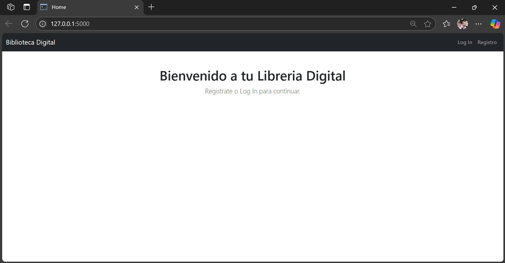
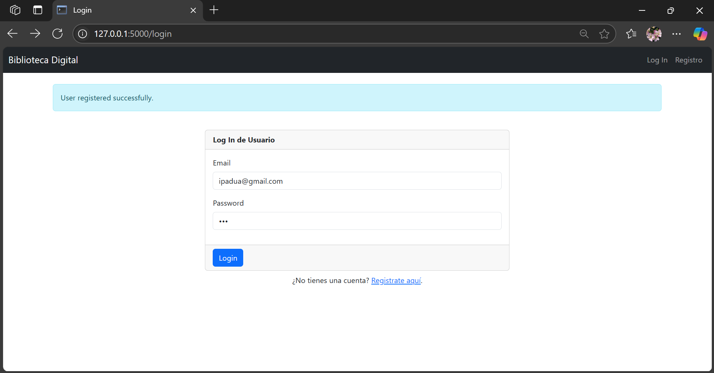
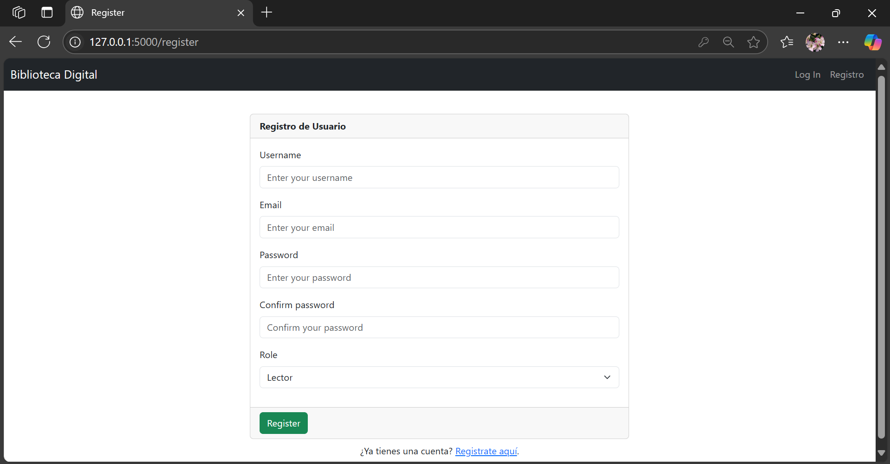

# 📚 Gestión de Biblioteca Personal Digital - Flask + MySQL

Esta plataforma permite a los usuarios gestionar su Biblioteca Digital. En la cual puedes registrarte, editar libros, añadir libros y borrar, facilitando tu experiencia como leyente. Existe la opción de tres roles en esta aplicación: **Admin**, **Moderador** y **Lector**. Cada uno con sus respectivas normativas y funcionalidades.

## 🧑‍💻 Integrantes del Equipo
- Lara V. Cordero Rodríguez - R00607366 - lcordero7366@arecibointer.edu
- Ian P. Padua Cuevas -R00608377 - ipadua8377@arecibointer.edu

A continuación, aquí se presentan las capturas de las interfaces de el proyecto:

### Página Principal
<figure class="image">
   
   <figcaption></figcaption>
</figure>

### Página de Log In
<figure class="image">
   
   <figcaption></figcaption>
</figure>

### Página de Registro
<figure class="image">
   
   <figcaption></figcaption>
</figure>

## 🚀 Tecnologías utilizadas

- **Flask** – Framework backend en Python
- **Flask-Login** – Sistema de autenticación
- **MySQL** – Base de datos relacional
- **SQLAlchemy** – ORM para la base de datos
- **Bootstrap 5** – Framework CSS responsivo
- **Jinja2** – Motor de plantillas para HTML

---

## 📂 Archivos del proyecto

| Archivo / Carpeta                                                 | Descripción                                                                |
| ----------------------------------------------------------------- | -------------------------------------------------------------------------- |
| `create_demo_users.py`                                            | Script para crear usuarios iniciales con roles y contraseñas               |
| `config.py`                                                       | Configuración de Flask (DB URI, claves, etc.)                              |
| `README.md`                                                       | Este archivo de documentación del proyecto                                 |
| `requirements.txt`                                                | Lista de paquetes Python requeridos                                        |
| **`run.py`**                                                      | Punto de entrada para ejecutar el servidor Flask                           |
| `app/__init__.py`                                                 | Inicializa la aplicación Flask y carga la configuración                    |
| `app/models.py`                                                   | Contiene los modelos SQLAlchemy: User, Role, Curso                         |
| `app/forms.py`                                                    | Formularios de Flask-WTF usados en login, registro, cursos, contraseñas    |
| `app/routes.py`                                                   | Rutas principales del proyecto (dashboard, cursos, cambiar contraseña)     |
| `app/auth_routes.py`                                              | Rutas para autenticación (login, registro, logout)                         |
| `app/templates/layout.html`                                       | Plantilla base HTML con barra de navegación                                |
| `app/templates/index.html`                                        | Página de inicio pública del sitio                                         |
| `app/templates/login.html`                                        | Formulario de login de usuario                                             |
| `app/templates/register.html`                                     | Formulario de registro con selección de rol                                |
| `app/templates/dashboard.html`                                    | Panel principal del usuario autenticado                                    |
| `app/templates/libro_form.html`                                   | Formulario de creación/edición de libros                                   |
| `app/templates/libros.html`                                       | Vista de libros creados por el usuario                                     |
| `app/templates/usuarios.html`                                     | Listado de usuarios con sus roles (solo para admins)                       |
| `app/templates/cambiar_password.html`                             | Formulario para cambiar la contraseña del usuario                          |
| `static/css/styles.css`                                           | Archivo CSS personalizado (opcional)                                       |
| `database_schema/11_biblioteca_digital.sql`                                   | SQL para crear la base de datos y tablas del proyecto de cursos            |
| `database_schema/02_biblioteca.sql` – `11_biblioteca_digital.sql` | Archivos SQL de los esquemas de bases de datos de los proyectos asignables |

---

## ⭐ Proyectos Final Asignado

Cada estudiante (o grupo) realizará uno de los siguientes proyectos como práctica final:

| Nº  | Proyecto                               | CRUD Principal    | Roles                            |
| --- | -------------------------------------- | ----------------- | -------------------------------- |
| 11  | Gestión de Biblioteca Personal Digital | Libros personales | Lector, Moderador, Admin         |

---

## 🧪 Requisitos previos

- Python 3.8 o superior
- MySQL Server corriendo localmente (`localhost:3306`)
- Un entorno virtual activo (opcional, pero recomendado)

---

## ⚙️ Instalación del proyecto

1. **Clonar el repositorio**

   ```bash
   git clone https://github.com/javierdastas/comp2052.git
   cd comp2052/final_project
   ```

2. **Crear entorno virtual y activarlo**

   > Todos los comandos en este paso 2 son opcionales. No requiere correrlos si VSCode no solicita hacerlo. Los comandos en este paso permitirán crear un ambiente virtual para instalar las librería requeridas solamente para este proyecto.

   ```bash
   python -m venv venv   # En Linux/Windows requiere esto
   ```

   ```bash
   python3 -m venv venv     # En Mac requiere esto
   ```

   > Para activar el virtual environment:

   ```bash
   venv\Scripts\activate.bat  # Solo para Windows
   ```

   ```bash
   source venv/bin/activate   # Solo en Linux/Mac requiere esto
   ```

3. **Instalar dependencias**

   ```bash
   pip install -r requirements.txt
   ```

4. **Crear la base de datos en MySQL**

   > Para ejecutar el archivo SQL para el proyecto directamente en MySQL:

   ```bash
   mysql -u root -p < database_schema/01_cursos.sql
   ```

   > Puedes utilizar Visual Studio Code u otra herramienta gráfica que se conecte a tu DBMS (servidor) de MySQL y correr el archivo correspondiente al proyecto para crear tu base de datos:

   ```bash
   01_cursos.sql
   ```

5. **Crear usuarios de prueba**

   ```bash
   python create_demo_users.py
   ```

6. **Ejecutar la aplicación**

   ```bash
   python run.py
   ```

   > Luego abre en tu navegador:

   ```bash
   http://127.0.0.1:5000
   ```

## ✅ Archivos clave para el estudiante

- app/models.py: Modelos SQLAlchemy
- app/forms.py: Formularios personalizados
- app/routes.py: Lógica del CRUD principal
- app/test_routes.py: Lógica del CRUD para pruebas
- templates/\*.html: Vistas HTML para CRUD y autenticación
- database_schema/XX_nombre.sql: Esquema SQL de cada proyecto final
- pruebas/\*.rest: Pruebas para CRUD de las rutas en `test_routes.py`

## 🗂️ Entregables - Documento en formato en PDF (proyecto.pdf)

> **IMPORTANTE**: El documento en PDF a entregar tiene que incluir las siguientes partes:

- Portada indicando:
  En el centro, al inicio de la página:

  - UIPR - Recinto de Arecibo
  - Programa de Ciencias de Computadoras

  En el centro de la página y de mayor tamaño:

  - nombre del proyecto
  - nombre del curso

  En la parte de abajo, y centralizado:

  - nombre cada uno de los integrantes del grupo con su número de indentificación
    Ejemplo: John Doe (R000123456)

- En el contenido debe incluir:
  - Capturas o imágenes de todas las pantallas (interfaces) requeridas para evidenciar que su proyecto es completamente funcional. Debe incluir una descripción de forma coherente y entendible que explique cada pantalla.
  - Nombres de los archivos de pruebas y copia del código para todos los end-points del CRUD principal del proyecto. Debe incluir una descripción breve de que hace cada archivo, incluyendo; si requiere enviarse algún valor, y si retorna algún valor. Puede ser en forma de tabla (nombre del archivo, valores enviados, valores esperados)
  - Pruebas de todos los end-points del CRUD principal del proyecto, capturas de pantallas de cada prueba.
    > **IMPORTANTE** : Para realizar las pruebas debes:
    - Modificar el archivo `test_routes.py` al igual que los archivos de pruebas en la carpeta (folder) `pruebas` de acuerdo a tu proyecto.
    - Además debe cambiar las líneas 17 y 18 del archivo `__init__.py` a:
    ```bash
    # from app.routes import main
    from app.test_routes import main
    ```
    > **IMPORTANTE** : Luego de finalizar las pruebas recuerda volver otra vez el código del archivo `__init__.py` a:
    ```bash
    from app.routes import main
    # from app.test_routes import main
    ```
    > **IMPORTANTE** : Cada vez que cambies el código del archivo `__init__.py` debes reiniciar el proyecto de Flask.
  - Para cada integrante del grupo el documento debe incluir las direcciones del repositorio o carpeta en Github. Puede realizar esta parte en forma de tabla (nombre del integrante, dirección en github) para cada integrante.


## 🗂️ Estructura Final del Proyecto a Entregar en su Github

```text
📦 raiz_del_proyecto/
├── run.py                 # Punto de entrada de la app Flask
├── config.py              # Configuración global (clave secreta, DB URI)
├── requirements.txt       # Dependencias del proyecto
├── create_demo_users.py   # Script para crear usuarios iniciales (admin, profesor, estudiante)
├── README.md              # Documentación del proyecto
├── proyecto.pdf           # Documentación del proyecto requerida para entregar en el curso.
|
├── 📁 pruebas/            # Incluir todos los archivos necesarios para probar el CRUD principal
│   ├── create.rest             # Test file to Create a Row
│   ├── read.rest               # Test file to Read Rows
│   ├── read-a-row.rest         # Test file to Read only one Row
│   ├── update.rest             # Test file to Update a Row
│   ├── delete.rest             # Test file to Delete a Row
|
├── 📁 app/
│   ├── __init__.py             # Inicializa Flask, SQLAlchemy y Blueprints
│   ├── models.py               # Modelos de base de datos (User, Role, Curso)
│   ├── forms.py                # Formularios Flask-WTF (registro, login, curso, contraseña)
│   ├── routes.py               # Rutas protegidas (dashboard, cursos, cambiar contraseña)
│   ├── test_routes.py          # Rutas o end-points para pruebas (cursos)
│   ├── auth_routes.py          # Rutas públicas (login, registro, logout)
|   |
│   ├── 📁 templates/
│   │   ├── layout.html           # Plantilla base para todas las vistas
│   │   ├── index.html            # Página de bienvenida pública
│   │   ├── login.html            # Formulario de inicio de sesión
│   │   ├── register.html         # Formulario de registro con selector de rol
│   │   ├── dashboard.html        # Vista principal del usuario logueado
│   │   ├── curso_form.html       # Formulario para crear/editar cursos
│   │   ├── cursos.html           # Lista de cursos creados
│   │   ├── usuarios.html         # Vista de administración de usuarios (solo admin)
│   │   └── cambiar_password.html # Formulario para cambiar contraseña
|   |
│   └── 📁 static/
│       └── 📁 css/
│           └── styles.css              # (Opcional) Estilos personalizados
```
## 🖥️Repositorios de Integrantes
- Lara V. Cordero Rodríguez:
- Ian P. Padua Cuevas: 

## 🧠 Licencia

Este proyecto es de uso académico y puede ser reutilizado con fines educativos indicando las referencias correspondientes del Proyecto. Este proyecto y la lista de proyectos son creaciones originales del profesor Javier A. Dastas de Ciencias de Computadoras.
